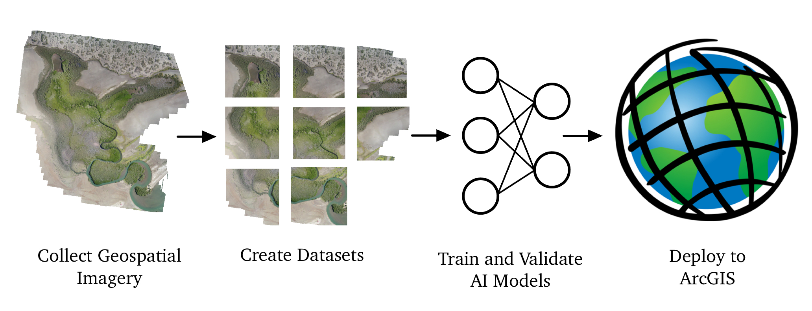

# Mangrove Monitoring : Machine Learning

This repo includes all development and tools related to the Machine Learning Development of the Mangrove Monitoring Project. Most of our active work is within the drone classification folder. 

We are working on two related projects: Mangrove Area Estimation and Human Activity Segmentation. 

The Mangrove Area Estimation project involves using machine learning models to identify mangroves from drone imagery. We perform binary segmentation on aerial images to label pixels as either mangrove or not mangrove.

The Human Activity project intends to detect human-made structures that pose a threat to mangroves. This includes things like roads and buildings, which each cause harm to the ecosystem. We are currently looking for appropriate datasets that will generalize well to mangrove environs.

The satellite super-resolution project (Currently Discontinued) aims to expand the capabilities of our mangrove identification models by enhancing satellite imagery to allow us to precisely track and identify mangroves anywhere on Earth without needing to deploy drones. It was discontinued because our classifiers do not function well even at the super-resolved resolution.

# Our Pipeline

## Data Processing
All of the tools related to processing geospatial data exists in the DroneClassification/data folder. Instructions for formatting data and the pipeline to process datasets are in the process_data notebook.

## Model Training
Model architecture and loss functions are in the DroneClassification/models folder. The tools used to train models exist in the training_utils folder. The pipeline to train a model is in the model_training_ground notebook.

### Current Classification Models:

UNet: ResNet18 Encoder, Segmentation Decoder

SegFormer B0/B2

### Super-Resolution Models being tested (currently on ice):

Schrödinger Bridge Latent Diffusion 

3-layer SRCNN

## ArcGIS
The ARC_Package folder contains the toolbox for ArcGIS Pro and the template for formatting a trained model for use with the toolbox. A ModelClass class must be created for each model architecture. 

# Todo:
## Data
- Sourcing labeled human infrastructure vs natural features data
- Add logic to handle tiles with incomplete/partial data rather than filtering them out. This would mean building labels with ignore_data values (255).
- Implement overlap in tile processing.
- Potentially creating our own labeled human vs natural data using our mangrove imagery.
- Normalizing and combining multiple human vs natural data sources for robust generalization

## ML
### Testing various approaches
- Architectures
- data augmentations
- loss functions
- optimizers, etc.

### Adding features to validation process
- Fixing odd issue in human segmentation visualizer where examples repeat (see end of human_segmentation.ipynb)
- Add option to select validation metrics in TrainingGround
- Add f1 score
- Nicer/better metrics plotting

## ArcGIS interface
### Frontend
- Optimize UI to filter available models by task (Mangrove Classification / Human vs Natural Classification)
- Abstract input image size, output channels/names, and model weights by packaging into the models

### Backend
- Trimming edges: We are including predictions where there is no input at the edges of the tif due to partial input tiles. Remove predictions in those areas.
- Blending overlap: Currently we just take the centermost tile predictions. It might be helpful to add some kind of blending logic.
- Batch Processing: Currently, we only process one tile at a time, but we could run multiple at once when using a GPU to accelerate the process.

