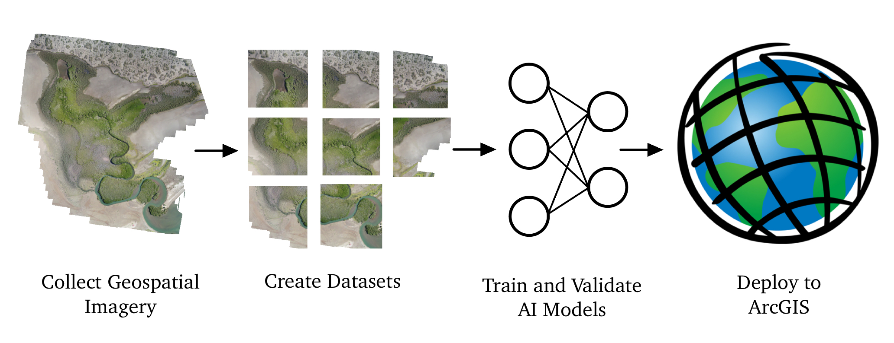

# Engineers for Exploration - Mangrove Monitoring

Machine learning platform for mangrove ecosystem monitoring from aerial and satellite imagery.

**Developed by**: Mangrove Monitoring Team, Engineers for Exploration (E4E), UC San Diego

---

## Overview

This repository provides tools for:

- **Pixel-level mangrove detection** from drone imagery (~100 km² labeled data)
- **Infrastructure detection** (roads, buildings) threatening mangrove ecosystems
- **ArcGIS Pro integration** for environmental scientists
- **Experimental architectures** including state-space models (Mamba)

---

## Quick Start

```bash
# Clone
git clone https://github.com/UCSD-E4E/ml-mangrove.git
cd ml-mangrove

# Setup environment
conda create -n mangrove python=3.11 -y
conda activate mangrove

# Install PyTorch (with CUDA if available)
# Follow https://pytorch.org/ to install torch for your OS
# Example for Windows: pip3 install torch torchvision --index-url https://download.pytorch.org/whl/cu126

pip install -r requirements.txt
```

See [Environment Setup](docs/setup/environment.md) for detailed instructions.

---

## Project Structure

```
ml-mangrove/
├── DroneClassification/    # Main ML pipeline
│   ├── data/               # Data processing & loading
│   ├── models/             # Model architectures & losses
│   ├── training_utils/     # Training framework
│   ├── experiments/        # Training outputs & logs
│   └── testing/            # Experimental work (Mamba integration)
├── ARC_Package/            # ArcGIS Pro toolbox
├── docs/                   # Documentation
└── archive/                # Historical approaches (reference only)
```

---

## Models

| Model | Use Case | Performance |
|-------|----------|-------------|
| **ResNet18-UNet** | Mangrove detection | 82-85% IoU |
| **SegFormer B0/B2** | Infrastructure detection | Fast / Accurate |
| **DeepLabv3+** | Multi-class segmentation | 81-84% mIoU |
| **MambaUNet** | Experimental (state-space) | 25× smaller model |

---

## Documentation

| Guide | Description |
|-------|-------------|
| [Environment Setup](docs/setup/environment.md) | Python, CUDA, WSL2 configuration |
| [ArcGIS Setup](docs/setup/arcgis.md) | Toolbox installation for ArcGIS Pro |
| [Data Preparation](docs/guides/data_prep.md) | Processing geospatial imagery |
| [Model Training](docs/guides/training.md) | Training segmentation models |
| [Inference](docs/guides/inference.md) | Running predictions |
| [Model Architectures](docs/architecture/models.md) | Architecture details |
| [Loss Functions](docs/architecture/losses.md) | Available loss functions |

Full documentation: [docs/index.md](docs/index.md)

---

## Pipeline



1. **Data Processing**: Tile GeoTIFFs, create train/val/test splits
2. **Model Training**: Train with custom losses (Jaccard, Boundary IoU)
3. **Deployment**: Package for ArcGIS Pro or run inference directly

---

## Key Files

| File | Purpose |
|------|---------|
| `DroneClassification/data/utils.py` | Geospatial utilities |
| `DroneClassification/models/models.py` | Model architectures |
| `DroneClassification/models/loss.py` | Loss functions |
| `DroneClassification/training_utils/training_utils.py` | Training framework |
| `ARC_Package/SegmentationToolbox.pyt` | ArcGIS toolbox |

---

## Contributing

1. Create a feature branch from `master`
2. Follow existing code style
3. Add tests for new functionality
4. Submit PR with clear description
